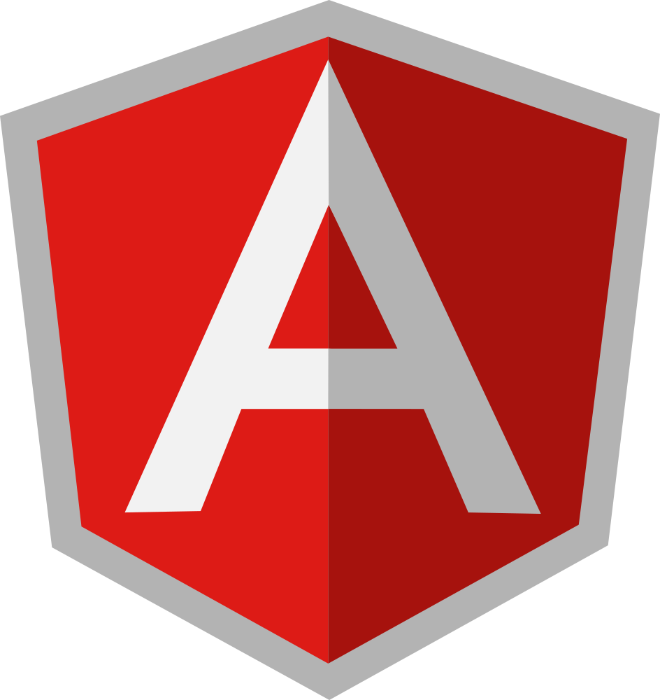
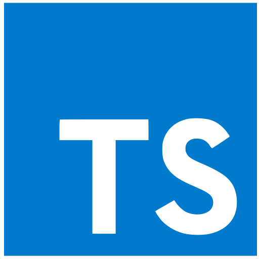
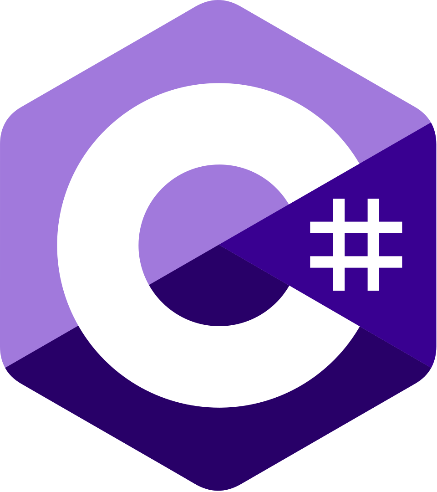
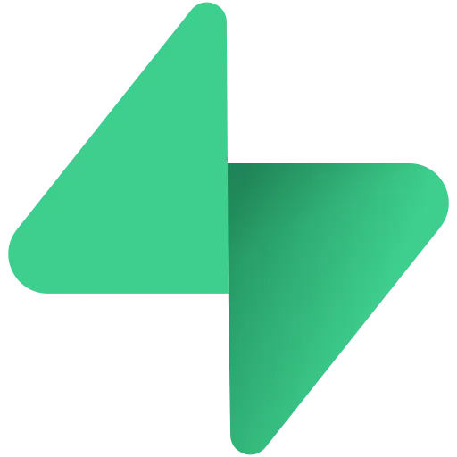
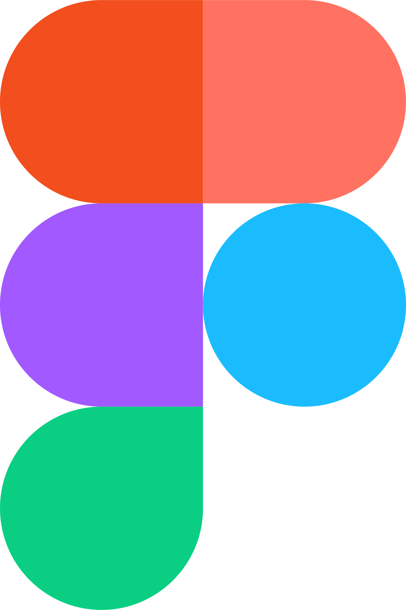

<h2 align="left">Olá meu nome e Hebert Rocha</h2>

Atuo no desenvolvimento full stack utilizando <strong>C#, .NET, Entity Framework, AngularJS, TypeScript e PostgreSQL</strong>, além de trabalhar também com tecnologias modernas do ecossistema JavaScript como <strong>Vue.js, React, Tailwind CSS, SASS e Node.js</strong>.

Minha trajetória começou no front-end, onde construí uma base sólida em componentização, UX/UI, criação de interfaces performáticas e boas práticas de código. Com o tempo, evoluí naturalmente para o backend, ampliando minha visão arquitetural e minha capacidade de entregar soluções completas do banco ao front.

Sou movido por organização, clareza e propósito no código. Gosto de colaborar, trocar conhecimento e buscar formas de aumentar a escalabilidade, qualidade e confiabilidade das aplicações que construo.

## 🚀 Tecnologias & Ferramentas

### **Frontend**
AngularJS • React.js • Vue.js • TypeScript • JavaScript • Tailwind CSS • SASS • HTML • CSS • Ionic • Pinia  

### **Backend**
C# • .NET • Entity Framework • PostgreSQL • MySQL • Supabase • Firebase • Node.js • GraphQL • CMS • CI/CD

### **Ferramentas & Práticas**
Storybook • Figma • Git/GitHub • Vite • Vitest • i18n • Yarn • npm • nvm • Clean Code • Arquitetura • Scrum

 

</img>
</img>
</img>
</img>
</img>
</img>
</img>
</img>
</img>
</img>
</img>
</img>
</img>
</img>
</img>
</img>
</img>
</img>

## 📌 O que busco
Consolidar cada vez mais minha senioridade como **Full Stack**, aprimorando arquitetura, testes, produtividade e decisões técnicas que aumentem a eficiência e confiabilidade dos sistemas.

📚 *Sempre aprendendo, sempre evoluindo, no código e como pessoa.*

 

  
<h2>Conecte-se comigo</h2>

   &nbsp;&nbsp;
   &nbsp;&nbsp;
<!--    &nbsp;&nbsp; -->
  

  

